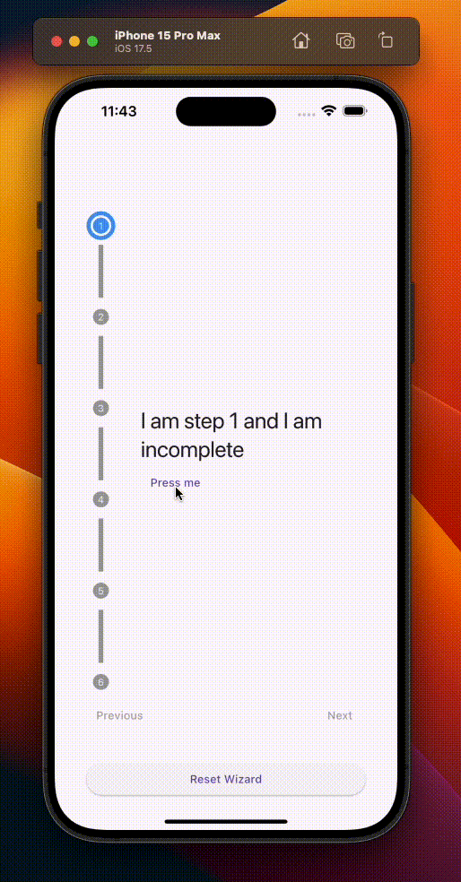
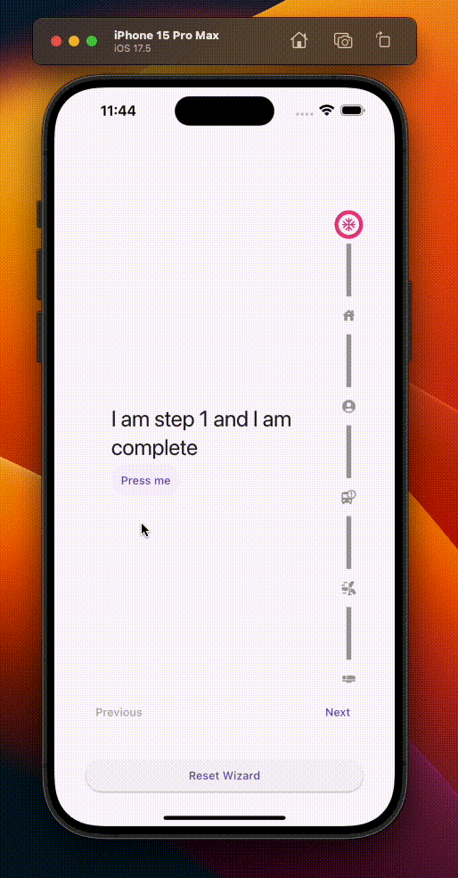
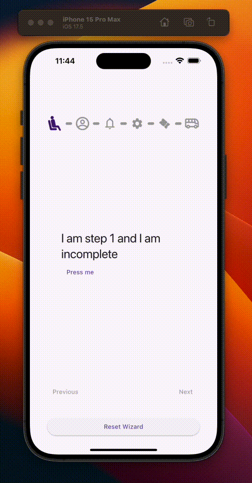

# Wizard Stepper

A customizable and easy-to-use wizard stepper widget for Flutter. Guide users through multi-step processes with clear progress indication and control.

## Features

* Customizable steps with individual content.
* Customizable step icons
* Tap into the baked-in navigation (next & previous) for quick usage, as well as the ability to add your own custom navigation buttons
* Callbacks for step completion and wizard finishing.
* Ability to listen for wizard events and the internal state of the wizard
* Easy integration with your existing Flutter app; any page widget can become a wizard page

### Basic Wizard

{width=300px}

### Wizard with Icons

{width=300px}

### Wizard with *Animated Icons
*(requires your own custom animations)

{width=300px}

### Wizard with Custon Buttons

{width=300px}

## Installation

1. Add `wizard_stepper` as a dependency in your `pubspec.yaml` file:

```yaml
dependencies:
  wizard_stepper: ^latest_version // Replace with the latest version
```

2. Install it

```sh
$ flutter pub get
```

3. Import it

```dart
import 'package:wizard_stepper/wizard_stepper.dart';
```

## API

### WizardStepper

The widget that represents the wizard itself. It holds the region that displays the wizard step navigation as well as the viewport to display the corresponding step in the wizard. Create an instance of the ```WizardStepper``` widget preferably inside a widget that can expand and fill the available (i.e. an ```Expanded``` widget).

```dart

WizardStepper(
  controller: WizardStepperController(
    // options go here
  ),
  steps: [
    OneStep(), 
    OneStep(),
    OneStep(),
    OneStep(),
    OneStep(),
  ],
)

```

### WizardStep 

Mixin that is applied to any widget that wants to participate in the Wizard Stepper flow.
All you need to do is add the ```WizardStep``` mixin to your widget, and you're good to go.

> [!NOTE]
> Caveat: by adding the mixin your widget cannot have a ```const``` constructor so just be aware of that.


```dart

/// Step class
class OneStep extends StatelessWidget with WizardStep {
  OneStep({super.key});
  
  @override
  Widget build(BuildContext context) {
    return Column(
      children: [

        // by adding the WizardStep mixin, you have available 
        // several flags, notifiers and callbacks to tap into
        // some of the wizard flow events
        Text('I am step number ${stepNumber + 1} and I am ${isComplete ? 'complete' : 'incomplete'}',)
      ]
    )
  }
}

```

By adding the ```WizardStep``` mixin, you have available several flags, notifiers and methods to tap into some of the wizard's goodies, such as:

- ***stepNumber***: your index in the wizard's list of steps (zero based)
- ***isComplete***: flag whether the step has been completed or not
- ***isCurrentStep***: flag whether the step is the current one being displayed

Also if you want to listen / subscribe for when these properties change and make your widgets more reactive, you can tap into the available notifiers in the ```WizardStep``` mixin, such as:

- ***isCompleteNotifier***: ```ValueNotifier``` of type ```bool``` to listen for changes in the step completion
- ***isCurrentStepNotifier***: ```ValueNotifier``` of type ```bool``` to listen for changes in the step being the current one being displayed
- ***stepNumberNotifier***:  ```ValueNotifier``` of type ```int``` to listen for assignment on the step number (only done once initially)
- ***completeStep(bool)***: helper method that takes in a ```bool``` value to notify the wizard to complete the current step. You can listen to its completion via the ```isCompleteNotifier``` above.

```dart

/// Step class
class OneStep extends StatelessWidget with WizardStep {
  OneStep({super.key});
  
  @override
  Widget build(BuildContext context) {
    return Padding(
      padding: const EdgeInsets.all(32),

      // you can add a ValueListenableBuilder to listen to any
      // of the available notifiers in the WizardStep mixin
      child: ValueListenableBuilder<bool>(
        valueListenable: isCompleteNotifier, // <- isCompleteNotifier is available via the WizardStep mixin
        builder: (context, isComplete, child) {
          return Column(
            crossAxisAlignment: CrossAxisAlignment.start,
            mainAxisAlignment: MainAxisAlignment.center,
            children: [
              Text('I am step ${stepNumber + 1} and I am ${isComplete ? 'complete' : 'incomplete'}', 
                style: Theme.of(context).textTheme.headlineMedium),

              TextButton(onPressed: () {
                completeStep(true); // <- completeStep is available via the WizardStep mixin
              }, 
              child: Text('Press me'))
            ],
          );
        }
      ),
    );
  }
}

```

> [!TIP]
> Add the ```WizardStep``` mixin to listen to whether your widget is the current step in the wizard as well as whether it has been completed or not by subscribing to the ```isCurrentStepNotifier``` and ```isCompleteNotifier``` notifiers respectively. You can use the available ```completeStep``` helper method to complete your step, then rebuild your widget using a ```ValueListenableBuilder``` around your ```isCompleteNotifier```.


### WizardStepperController

The controller that orchestrates the wizard interactions and the creation of all elements that come together to bring the wizard to life.
You create an instance of the ```WizardStepperController``` preferably in the ```initState``` of the ```StatefulWidget``` that will host your wizard, and set the corresponding options as desired.

```dart
  
  controller = WizardStepperController(

    // callbacks
    onStepCompleted: (index, isComplete) { ... },
    onSelectedStep: (index) { ... },
    onMovedToNext: () { ... },
    onMovedToPrevious: () { ... },
    onWizardReset: () { ... },
    onMovedToLastStep: () { ... },
    onOrientationSwitched: () { ... },

    // position & orientation
    orientation = WizardStepperOrientation.horizontal,
    position = WizardStepperPosition.top,

    // colors
    completedStepColor = Colors.green,
    currentStepColor = Colors.blue,
    stepColor = Colors.grey,
    stepNumberColor = Colors.white,
    dividerColor = Colors.grey,

    // values
    stepSize = 20,
    dividerThickness = 6,
    dividerMargin = 6,
    dividerRadius = 0,
    borderSize = 5,
    stepBackgroundSize = 36,
    stepShape = BoxShape.circle,
    stepIconSize = 20,
    stepBorderRadius = 20,

    // flags
    showStepDividers = true,
    showStepNumber = true,

    // button-related properties
    showNavigationButtons = false,
    previousButtonLabel = 'Previous',
    nextButtonLabel = 'Next',
    finalStepButtonLabel = 'Complete',
    previousButtonStyle,
    nextButtonStyle,
  ) 

```

### WizardStepperController properties

#### Callbacks
 - ***onStepCompleted(index, isComplete)***: Returns the index of the completed step as well as a boolean flag to denote its completion.
- ***onSelectedStep(index)***: Returns the index of the selected step.
- ***onMovedToNext***: Notifies that the wizard has moved to the next step.
- ***onMovedToPrevious***: Notifies that the wizard has moved to the previous step.
- ***onWizardReset***: Notifies that the wizard has been reset.
- ***onMovedToLastStep***: Notifies that the wizard has moved to the last step.
- ***onOrientationSwitched***: Notifies that the wizard orientation has been switched.


#### Position & Orientation
- ***orientation***: sets the orientation of the wizard steps; it could be one of two values: ```WizardStepperOrientation.horizontal``` or ```WizardStepperOrientation.vertical```. Default is horizontal.
- ***position***: sets the position of the wizard steps in regards to the orientation; it could be one of four values: ```WizardStepperPosition.top```, ```WizardStepperPosition.bottom``` (for horizontal orientation) or ```WizardStepperPosition.left```, ```WizardStepperPosition.right``` (for vertical orientation). Default is top.


#### Colors
- ***completedStepColor***: sets the color of the completed step. Defaults to ```Colors.green```.
- ***currentStepColor***: sets the color of the current step. Defaults to ```Colors.blue```.
- ***stepColor***: sets the color of the uncompleted steps. Defaults to ```Colors.grey```.
- ***stepNumberColor***: sets the color of the step number. Defaults to ```Colors.white```.
- ***dividerColor***: sets the color of the step dividers. Defaults to ```Colors.grey```.

#### Values
- ***stepSize***: sets the size of the wizard step indicator. Defaults to ```20```.
- ***dividerThickness***: sets the thickness of the dividing widget, whether it is in vertical or horizontal position. Defauls to ```6```.
- ***dividerMargin***: sets a margin between the wizard step indicators and the dividers. Defaults to ```6```.
- ***dividerRadius***: sets the border radius of the dividers. Defaults to ```0```.
- ***borderSize***: sets the border size of the wizard step indicator (not applicable when having widgets as widget steps indicators, only icons and default numbers). Defaults to ```5```;
- ***stepBackgroundSize***: sets the color of the background of the step (only applicable to the default and icon step indicators). Defaults to ```36```.
- ***stepShape***: sets the shape of the wizard step indicator. Defaults to ```BoxShapecircle```, but you could use also ```BoxShape.square```.
- ***stepIconSize***: sets the size of the icon  (if ```stepIcons``` are provided). Defaults to ```20```.
- ***stepBorderRadius***: sets the border radius of the wizard step indicator. Defaults to ```20```.

### Flags
- ***showStepDividers***: whether we should display dividers or not. Defaults to ```true```.
- ***showStepNumber***: whether we should display step numbers or not. Defaults to ```true```.

### Button-related properties
- ***showNavigationButtons***: whether you'd like to use the default navigation buttons or not. Defaults to ```false``` meaning you must provide your own navigation capabilities. See the ```example``` folder to see how to implement your own navigation capabilities.
- ***previousButtonLabel***: if ```showNavigationButtons``` is true, set the label for the previous button. Defaults to ```Previous```.
- ***nextButtonLabel***: if ```showNavigationButtons``` is true, set the label for the next button. Defaults to ```Next```.
- ***finalStepButtonLabel***: if ```showNavigationButtons``` is true and in the last step, set the label for the next button. Defaults to ```Complete```.
- ***previousButtonStyle***: if ```showNavigationButtons``` is true, set the style for the previous button.
- ***nextButtonStyle***: if ```showNavigationButtons``` is true, set the style for the next button.

# Bugs or Requests 
If you encounter any problems feel free to open an [issue](https://github.com/romanejaquez/wizard_stepper/issues/new?template=bug_report.md). If you feel this package is missing a feature, please raise a [ticket](https://github.com/romanejaquez/wizard_stepper/issues/new?template=feature_request.md) on GitHub and I'll look into it. Pull request are also welcome.